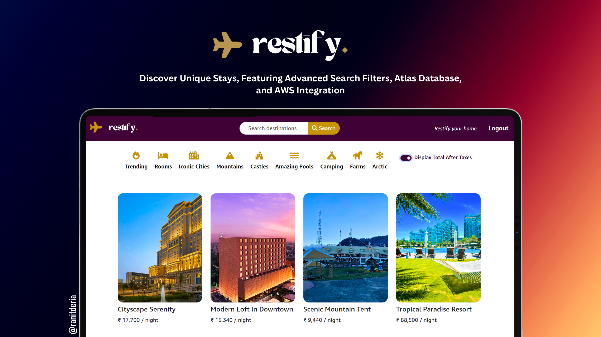
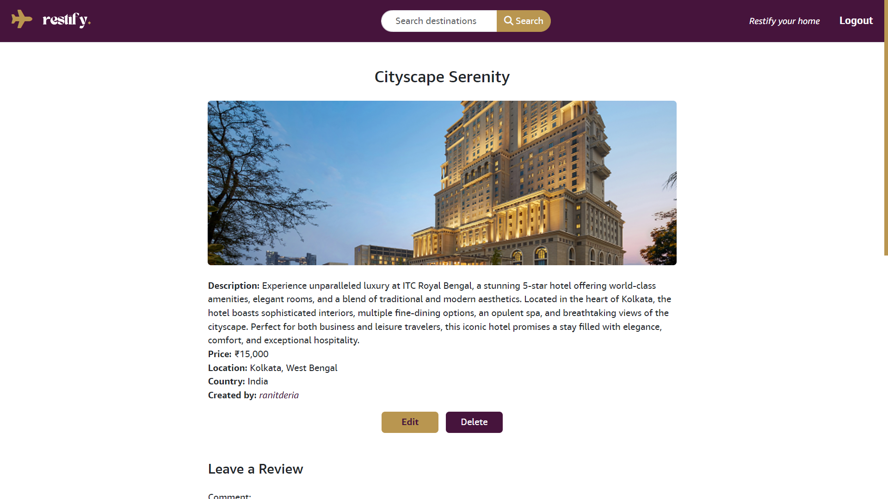
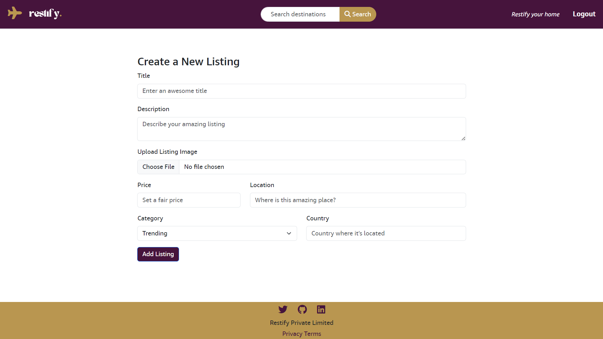
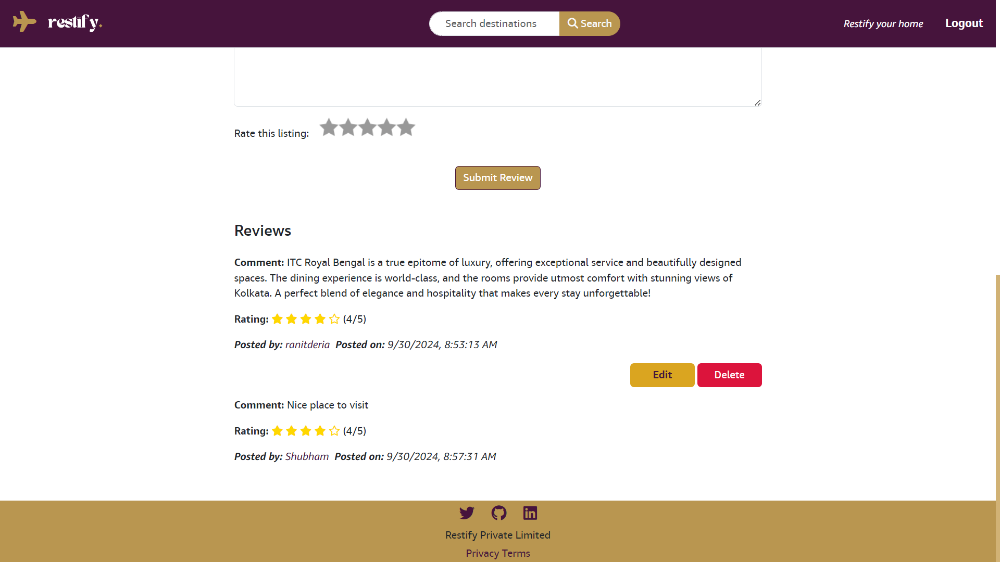
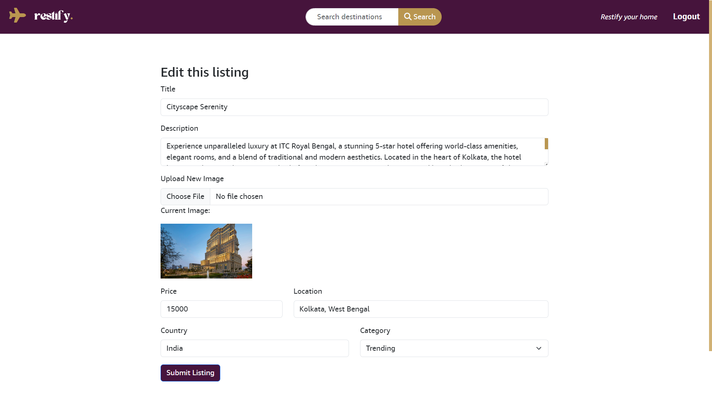

<div align="center">
  
  


[](https://twitter.com/intent/follow?screen_name=DeriaRanit)
[](https://www.linkedin.com/in/ranit-deria-916864257/)


  <br />
  <br />
  
  

  <h2 align="center">Restify - Discover Unique Stays, Powered by Advanced Search Filters</h2>

  Restify is a web application for exploring and listing rental properties, offering users the ability to browse homes, book stays, and host their own listings. It features an intuitive design with geolocation-based search, user authentication, reviews, and dynamic filtering for a seamless experience.<br />
  
<a href="https://restify-9ua6.onrender.com/listings"><strong>➥ Live Demo</strong></a>

</div>

## Table of Contents

- [Prerequisites](#prerequisites)
- [Technologies Utilized](#technologies-utilized)
- [Features](#features)
- [Run Locally](#run-locally)
- [Installation](#installation)
- [Usage](#usage)
- [Deployment](#deployment)
- [Environment Variables](#environment-variables)
- [Screenshots](#screenshots)
- [Contributing](#contributing)
- [License](#license)
- [Contact](#contact)

### Prerequisites:<a name="prerequisites"></a>

Before running the Restify application on your local machine, ensure you have the following installed:

- **[Node.js](https://nodejs.org/)** (version 14 or higher)
- **[MongoDB](https://www.mongodb.com/try/download/community)** (local installation or MongoDB Atlas account)
- **[Cloudinary](https://cloudinary.com/)** (for image uploads)
- **[Git](https://git-scm.com/)** (for cloning the repository)

You will also need to set up the required environment variables listed below:

```bash
ATLASDB_URL=<your MongoDB Atlas connection string>
SESSION_SECRET=<your session secret>
CLOUDINARY_CLOUD_NAME=<your Cloudinary cloud name>
CLOUDINARY_API_KEY=<your Cloudinary API key>
CLOUDINARY_API_SECRET=<your Cloudinary API secret>
MAPBOX_TOKEN=<your Mapbox token>
```
### Technologies Utilized: <a name="technologies-utilized"></a>
<div style="display: inline_block">  
 
 
 
 
 
 &nbsp;
&nbsp;&nbsp;
&nbsp;&nbsp;
&nbsp;
&nbsp;

### Features: <a name="features"></a>
* **User Authentication:** Secure login and registration using Passport.js.
* **Image Uploads:** Host images via Cloudinary.
* **Dynamic Search:** Search by country or location using geolocation features.
* **Category Filtering:** Explore listings with category-based filters like trending, rooms, iconic cities, mountains, etc.
* **Reviews:** Users can leave reviews and ratings on listings.
* **Responsive Design:** Fully responsive design with support for mobile and tablet devices.
* **Security:** Implemented using Helmet.js and secure MongoDB sessions.

### Run Locally: <a name="run-locally"></a>
To run **Restify** locally, follow the steps below:

**Linux and macOS:**
```bash
sudo git clone https://github.com/ranitderia/restify.git
cd restify
npm install
npm start
```

**Windows:**
```bash
git clone https://github.com/ranitderia/restify.git
cd restify
npm install
npm start
```

### Installation: <a name="installation"></a>
Clone the repository from GitHub:

[](https://github.com/RanitDERIA/restify.git)


### Usage: <a name="usage"></a>
* **Browse Listings:** Explore listings based on location or category.
* **Sign Up/Login:** Create an account to access full features, like adding reviews and listing your own properties.
* **Host Your Property:** Click on the "Restify your home" button to list your property with image uploads via Cloudinary.
* **Leave Reviews:** Review properties you’ve stayed at.

### Deployment: <a name="deployment"></a>
Restify can be deployed to platforms like Render, Heroku, or any Node.js hosting service that supports MongoDB.

### Environment Variables: <a name="environment-variables"></a>
You will need the following environment variables in your .env file or hosting provider’s environment settings:

```bash
ATLASDB_URL=<your MongoDB Atlas connection string>
SESSION_SECRET=<your session secret>
CLOUDINARY_CLOUD_NAME=<your Cloudinary cloud name>
CLOUDINARY_API_KEY=<your Cloudinary API key>
CLOUDINARY_API_SECRET=<your Cloudinary API secret>
MAPBOX_TOKEN=<your Mapbox token>
```

### Screenshots: <a name="screenshots"></a>





### Contributing: <a name="contributing"></a>
Contributions are always welcome!

If you'd like to contribute to this project, please follow these guidelines:

Fork the repository.
1. Create a new branch for your feature or bug fix.
2. Make your changes and commit them with descriptive messages.
3. Push your changes to your fork.
4. Submit a pull request.

Thank you for contributing to this project!

### License: <a name="license"></a>
This project is free to use and is licensed under the MIT License.

### Contact: <a name="contact"></a>

If you want to get in touch or have any questions regarding this project, feel free to reach out to me on **[LinkedIn](https://www.linkedin.com/in/ranit-deria-916864257/)** or follow me on **[Twitter](https://twitter.com/DeriaRanit)**.

For any inquiries, you can also open an issue or send a message directly via GitHub.
